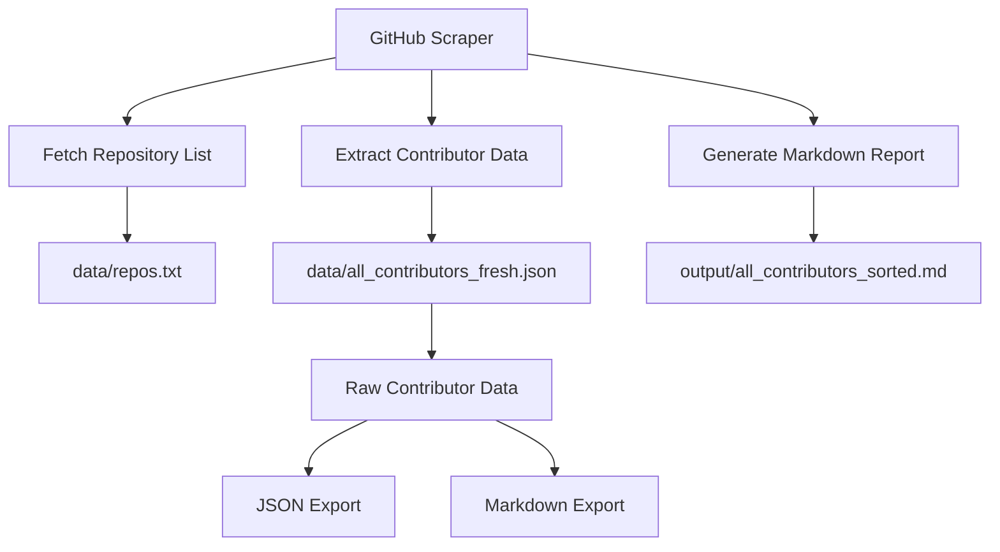
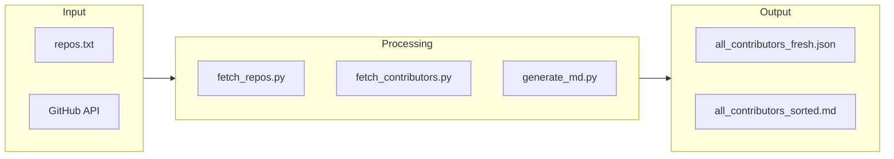
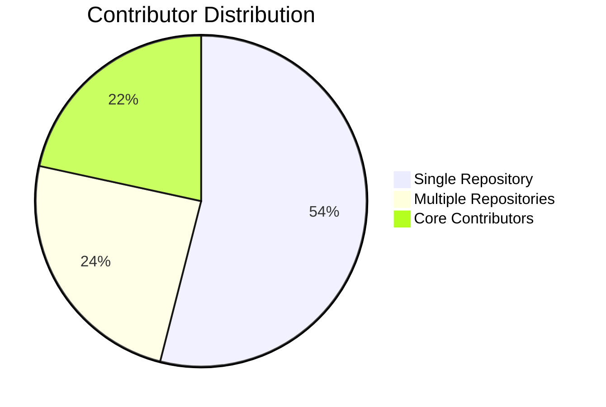

# 🌟 GitHub Scraper for Codefury Projects


A powerful and efficient GitHub scraping tool designed to collect and analyze contributor data from multiple Codefury hackathon repositories. This project helps visualize the collaborative efforts of participants across various Codefury editions.

## 📄 View Leaderboard

Check out the complete list of contributors for all Codefury projects:

<div align="center">

[](output/all_contributors_sorted.md)

</div>


## 📊 Project Overview



## 🚀 Features

- **Multi-Repository Scraping**: Collects data from hundreds of Codefury repositories
- **Contributor Analytics**: Identifies all participants with their GitHub profiles and avatars
- **Data Export**: Generates organized JSON and markdown outputs
- **Efficient Processing**: Handles large datasets with optimized scripts
- **Beautiful Visualization**: Creates comprehensive contributor leaderboards

## 🏗️ Architecture



## 📁 Project Structure

```
codefury-github-scraper/
├── 📂 data/
│   ├── all_contributors_fresh.json      # Raw contributor data
│   └── repos.txt                        # List of target repositories
├── 📂 output/
│   └── all_contributors_sorted.md       # Processed contributor leaderboard
├── 📂 scripts/
│   ├── fetch_contributors.py           # Contributor data extraction
│   ├── fetch_repos.py                  # Repository listing
│   └── generate_md.py                  # Markdown report generation
├── LICENSE
└── README.md
```

## 🛠️ Installation & Usage

### Prerequisites
- Python 3.8+
- GitHub Personal Access Token
- Required Python packages: `requests`, `json`, `os`

### Setup

1. **Clone the repository**
   ```bash
   git clone https://github.com/kushalkumarj2006/GitHub-Scraper-for-Codefury-Projects.git
   cd GitHub-Scraper-for-Codefury-Projects
   ```

2. **Install dependencies**
   ```bash
   pip install requests
   ```

3. **Configure GitHub Token**
   ```bash
   export GITHUB_TOKEN='your_github_token_here'
   ```

4. **Run the scraping process**
   ```bash
   # Fetch repository list
   python scripts/fetch_repos.py
   
   # Extract contributor data
   python scripts/fetch_contributors.py
   
   # Generate report
   python scripts/generate_md.py
   ```

## 📈 Data Insights

The scraper successfully analyzed **373 Codefury repositories** with contributions from **hundreds of developers**. The data reveals:

- 👥 Team collaboration patterns
- 📊 Project distribution across Codefury events
- 🌟 Rising stars in the hackathon community



## 🤝 Contributing

We welcome contributions to enhance this project! Here's how you can help:

1. Fork the repository
2. Create a feature branch (`git checkout -b feature/amazing-feature`)
3. Commit your changes (`git commit -m 'Add amazing feature'`)
4. Push to the branch (`git push origin feature/amazing-feature`)
5. Open a Pull Request

## 📄 License

This project is licensed under the MIT License - see the [LICENSE](LICENSE) file for details.

## 🙏 Acknowledgments

- **Codefury Organizers**: For hosting amazing hackathons
- **GitHub**: For providing excellent API access
- **All Contributors**: Whose data made this analysis possible

## 📞 Contact

**Kushal Kumar**  
- GitHub: [@kushalkumarj2006](https://github.com/kushalkumarj2006)
- Email: kushalkumarj2006@gmail.com

---

<div align="center">

**⭐ Don't forget to star this repository if you found it useful!**

</div>
